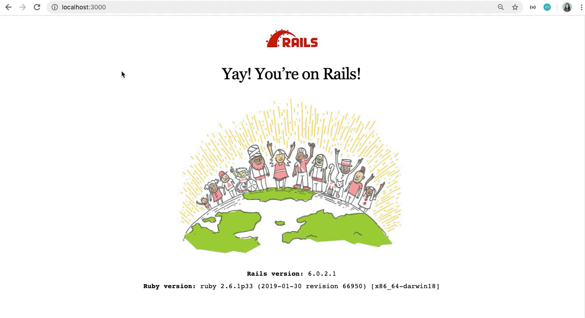

# Module 2 Fullstack Coffee App 

This was a one week, Mod 2, fullstack project. We made this for a singular coffee shop, one who deals with providing a number of roasters at their shop. Our intention was to create a system for ordering and tracking inventory. Feel free to take a look around -- 

---

* Ruby version - ruby 2.6.1

* Setup
You will need to have rails pre-installed to view this project. From there you will need to: 
    * bundle install 
    * rails db:migrate
    * rails db:seed 
    * run rails s

### Technologies 

* Ruby on Rails 
* Active Record 
* Javascript 

### Authors

* Parada (Alice) Richardson - [Github Repo](https://github.com/Paradafaii28)
* Miwha Geschwind - [Github Repo](https://github.com/miwhag)

